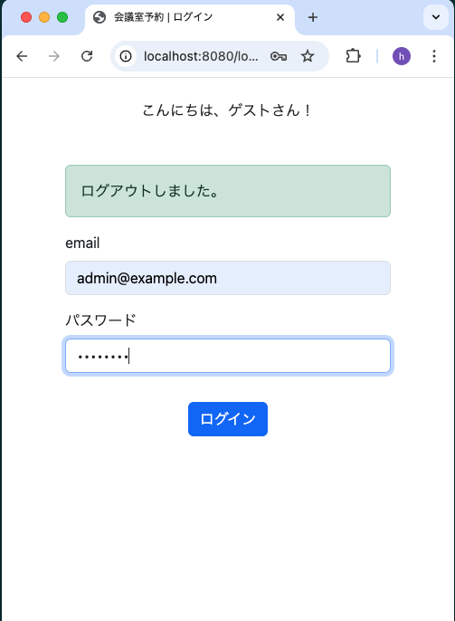
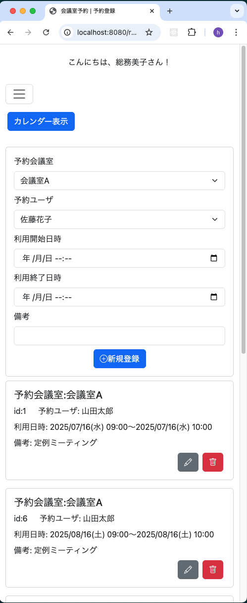
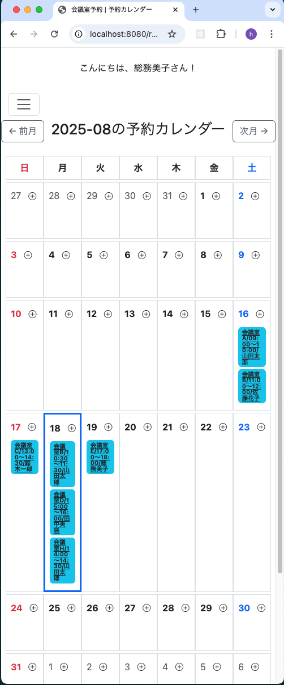
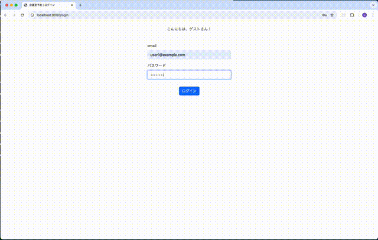
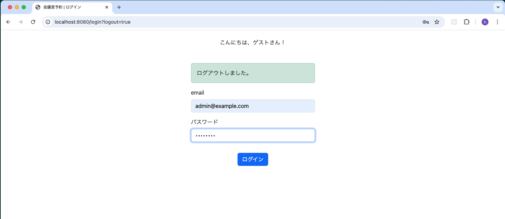
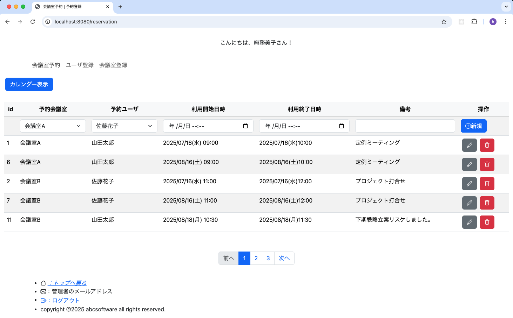
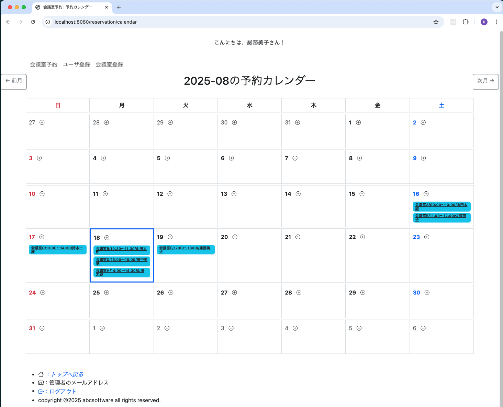

# 会議室予約システム

## 概要

このアプリケーションは、Spring Boot, Thymeleaf, RDB(MySQL) を使用した会議室予約システムです。

社内の会議室予約を管理する為のシンプルな Web アプリケーションです。
画面表示は PC とスマホで切り替えています。

新人研修の課題プログラムに適していると思います。

主な機能

- ログイン
- 会議室予約
  - 予約一覧
  - 予約登録/変更/取消
  - 予約カレンダー表示
- 管理機能(管理ユーザのみ)
  - ユーザ一覧
  - ユーザの登録/変更/削除
  - 会議室一覧
  - 会議室の登録/変更/削除

開発現場で利用頻度の高い以下の要素を実装しています。

- 認証認可(自前のユーザテーブル使用)
- 入力値の妥当性チェック (validation)
- カスタムアノテーション
- テンプレートフラグメント
- データベース。読取/登録/更新/削除(CRUD)
- 画像アップロード/ファイルアップロード
- カレンダー UI (月送り対応)
- ページング処理
- レスポンシブ対応 (PC/スマホ)

## デモ画面(スマホ)

### 操作イメージ

<div style="display: flex; gap: 10px; align-items: flex-start;">
  
</div>

### ログイン

<div style="display: flex; gap: 10px; align-items: flex-start;">
  
</div>

### 会議室予約

<div style="display: flex; gap: 10px; align-items: flex-start;">
  
</div>

### 予約カレンダー

<div style="display: flex; gap: 10px; align-items: flex-start;">
  
</div>

## デモ画面(PC)

### 操作イメージ

<div style="display: flex; gap: 10px; align-items: flex-start;">
  
</div>

### ログイン

<div style="display: flex; gap: 10px; align-items: flex-start;">
  
</div>

### 会議室予約

<div style="display: flex; gap: 10px; align-items: flex-start;">
  
</div>

### 予約カレンダー

<div style="display: flex; gap: 10px; align-items: flex-start;">
  
</div>

---

## 使用技術

- **フロントエンド**: Thymeleaf, Bootstrap
- **バックエンド**: Spring Boot,Spring Security, Gradle
- **データベース**: MySQL
- **インフラ**: Docker, Docker Compose

## セットアップ手順

```bash
# リポジトリをクローン
git clone https://github.com/hidepon4649/meetingroom-reservation-app.git
```

## アプリケーション起動手順

```bash
# docker-composeのディレクトリに移動して、下記２つのコマンドを実行して下さい。
docker compose build
docker compose up -d

# ブラウザから下記URL
http://localhost:8080/login
# 管理ユーザ id/pw
admin@example.com/password
# 一般ユーザ id/pw
user1@example.com/password
```
